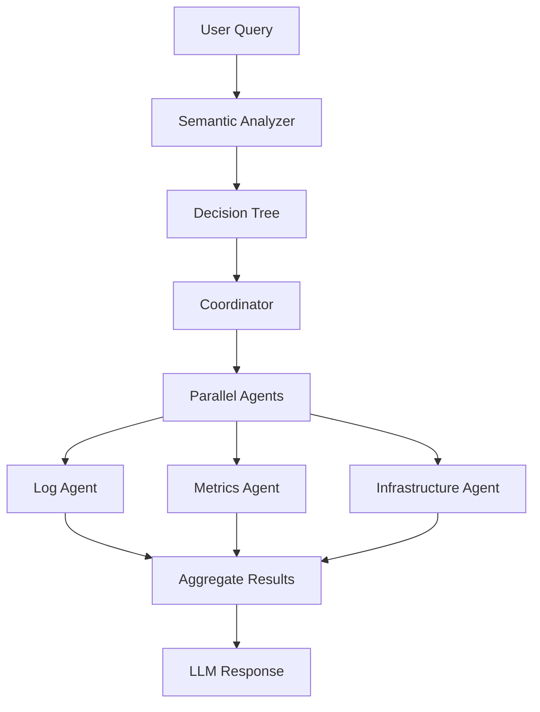

Clanker uses a sophisticated multi-agent architecture to investigate your cloud infrastructure intelligently. Rather than making sequential API calls, the system spawns specialized agents in parallel to gather context efficiently.

## Architecture overview

The agent system consists of three core components:

<CardGroup cols={3}>
  <Card title="Coordinator" icon="sitemap">
    Orchestrates parallel agent execution using decision trees
  </Card>
  <Card title="Semantic analyzer" icon="brain">
    Classifies user intent without external API calls
  </Card>
  <Card title="Specialized agents" icon="users">
    Domain-specific workers (logs, metrics, K8s, security, etc.)
  </Card>
</CardGroup>

## How it works

When you ask a question, Clanker follows this workflow:



### 1. Semantic analysis

The semantic analyzer performs lightweight NLP to classify your query **without calling external services**. It scores intent by summing keyword weights and infers urgency, timeframe, and target services.

<CodeGroup>
```go internal/agent/semantic/analyzer.go:27-69
func (sa *Analyzer) AnalyzeQuery(query string) model.QueryIntent {
    queryLower := strings.ToLower(query)
    words := strings.Fields(queryLower)

    intent := model.QueryIntent{
        Confidence:     0.0,
        TargetServices: []string{},
        Urgency:        "medium",
        TimeFrame:      "recent",
        DataTypes:      []string{},
    }

    // Score intent by summing word weights
    intentScores := make(map[string]float64)
    for intentType, signals := range sa.IntentSignals {
        score := 0.0
        for _, word := range words {
            if weight, exists := signals[word]; exists {
                score += weight
            }
        }
        intentScores[intentType] = score
    }

    // Select highest-scoring intent
    maxScore := 0.0
    for intentType, score := range intentScores {
        if score > maxScore {
            maxScore = score
            intent.Primary = intentType
        }
    }

    // Calculate confidence based on query length
    if len(words) > 0 {
        intent.Confidence = math.Min(maxScore/float64(len(words)), 1.0)
    }

    // Identify target services
    for service, keywords := range sa.ServiceMapping {
        for _, keyword := range keywords {
            if strings.Contains(queryLower, keyword) {
                intent.TargetServices = append(intent.TargetServices, service)
                break
            }
        }
    }
```
</CodeGroup>

<Tip>
**Fast and offline**: Semantic analysis runs entirely locally using keyword matching and weighted scoring. No LLM calls are needed for this step.
</Tip>

### 2. Decision tree traversal

The coordinator uses the semantic analysis to traverse a decision tree that maps user intent to agent execution strategies.

<CodeGroup>
```go internal/agent/decisiontree/tree.go:31-49
func (t *Tree) Traverse(query string, ctx *model.AgentContext) []*Node {
    var applicable []*Node
    t.traverseNode(t.Root, query, ctx, &applicable)
    return applicable
}

func (t *Tree) traverseNode(node *Node, query string, ctx *model.AgentContext, applicable *[]*Node) {
    if t.evaluateCondition(node.Condition, query) {
        *applicable = append(*applicable, node)
        t.CurrentPath = append(t.CurrentPath, node.ID)
        t.Decisions = append(t.Decisions, *node)
        for _, child := range node.Children {
            t.traverseNode(child, query, ctx, applicable)
        }
    }
}
```
</CodeGroup>

Each node in the tree specifies:
- **Condition**: When this strategy applies (keyword matching)
- **Agent types**: Which specialized agents to spawn
- **Priority**: Execution order for dependency management
- **Parameters**: Configuration for the agents

### 3. Parallel agent execution

The coordinator spawns agents in **dependency-aware groups**, running independent agents in parallel while respecting data dependencies.

<CodeGroup>
```go internal/agent/coordinator/coordinator.go:63-111
func (c *Coordinator) SpawnAgents(ctx context.Context, applicable []*dt.Node) {
    agentConfigs := make(map[string]AgentConfig)

    for _, node := range applicable {
        for _, name := range node.AgentTypes {
            agt, ok := c.lookupAgentType(name)
            if !ok {
                continue
            }
            if existing, exists := agentConfigs[name]; !exists || node.Priority > existing.Priority {
                agentConfigs[name] = AgentConfig{
                    Priority:   node.Priority,
                    Parameters: node.Parameters,
                    AgentType:  agt,
                }
            }
        }
    }

    if len(agentConfigs) == 0 {
        return
    }

    // Plan execution order based on dependencies
    planned := c.scheduler.Plan(agentConfigs)
    verbose := verboseAgents()

    // Execute agents in dependency order
    for _, group := range planned {
        if verbose {
            fmt.Printf("📊 Executing order group %d with %d agents\n", group.Order, len(group.Agents))
        }
        var wg sync.WaitGroup
        for _, cfg := range group.Agents {
            if !c.scheduler.Ready(cfg.AgentType, c.dataBus) {
                if verbose {
                    fmt.Printf("⏸️  Agent %s waiting for dependencies\n", cfg.AgentType.Name)
                }
                continue
            }
            agent := c.newParallelAgent(cfg)
            c.registry.Register(agent)
            wg.Add(1)
            go c.runPlannedAgent(ctx, &wg, agent)
        }
        wg.Wait()
        if verbose {
            fmt.Printf("✅ Order group %d completed\n", group.Order)
        }
    }
}
```
</CodeGroup>

## Agent types

Clanker includes specialized agents for different investigation domains:

<AccordionGroup>
  <Accordion title="Log agent" icon="file-lines">
    Discovers log groups, retrieves recent entries, and identifies error patterns.
    
    **Provides**: `logs`, `error_patterns`, `log_metrics`  
    **Execution order**: 1 (no dependencies)
  </Accordion>

  <Accordion title="Metrics agent" icon="chart-line">
    Gathers CloudWatch metrics, performance data, and threshold violations.
    
    **Provides**: `metrics`, `performance_data`, `thresholds`  
    **Execution order**: 1 (no dependencies)
  </Accordion>

  <Accordion title="Infrastructure agent" icon="server">
    Checks service configuration, deployment status, and resource health.
    
    **Provides**: `service_config`, `deployment_status`, `resource_health`  
    **Execution order**: 2 (can use metrics/logs if available)
  </Accordion>

  <Accordion title="Security agent" icon="shield">
    Analyzes access patterns, security configurations, and vulnerabilities.
    
    **Requires**: `logs`, `service_config`  
    **Provides**: `security_status`, `access_patterns`, `vulnerabilities`  
    **Execution order**: 3 (depends on logs and infrastructure)
  </Accordion>

  <Accordion title="K8s agent" icon="dharmachakra">
    Inspects Kubernetes cluster resources, pod health, and deployment status.
    
    **Provides**: `k8s_resources`, `k8s_health`  
    **Execution order**: 1 (no dependencies)
  </Accordion>

  <Accordion title="Performance agent" icon="gauge-high">
    Identifies bottlenecks and provides scaling recommendations.
    
    **Requires**: `metrics`, `logs`, `resource_health`  
    **Provides**: `performance_analysis`, `bottlenecks`, `scaling_recommendations`  
    **Execution order**: 5 (depends on metrics, logs, infrastructure)
  </Accordion>
</AccordionGroup>

See the full list in [`internal/agent/coordinator/agent_types.go`](https://github.com/bgdnvk/clanker/blob/main/internal/agent/coordinator/agent_types.go).

## Chain of thought tracking

Every agent decision is recorded in a chain of thought for debugging and transparency:

<CodeGroup>
```go internal/agent/agent.go:109-134
a.addThought(agentCtx, fmt.Sprintf("Starting investigation of query: '%s'", query), "analyze", "Query received, beginning analysis")
a.addThought(agentCtx, fmt.Sprintf("Semantic analysis: Intent=%s, Confidence=%.2f, Urgency=%s",
    queryIntent.Primary, queryIntent.Confidence, queryIntent.Urgency), "analyze", "Performed semantic analysis")

// ...

a.addThought(agentCtx, fmt.Sprintf("Decision tree identified %d applicable strategies", len(applicableNodes)), "analyze", "Determined parallel execution strategy")

// ...

stats := coord.Stats()
a.addThought(agentCtx, fmt.Sprintf("Completed parallel execution with %d agents", stats.Total), "success", "Data gathering completed")

if verbose {
    fmt.Printf("🎉 Parallel execution completed: %d successful, %d failed\n",
        stats.Completed, stats.Failed)
}
```
</CodeGroup>

<Info>
Enable agent tracing with `--agent-trace` or `debug: true` in your config to see detailed coordinator lifecycle logs.
</Info>

## Performance characteristics

| Approach | Time | Requests |
|----------|------|----------|
| Sequential (naive) | 6-8 seconds | 5-10 serial calls |
| Parallel agents | 2-3 seconds | 5-10 concurrent calls |

By running independent agents in parallel, Clanker reduces investigation time by 60-70% compared to sequential approaches.

## Example execution

Here's what happens when you ask "Why is my Lambda failing?":

```bash
clanker ask "Why is my Lambda failing?" --agent-trace
```

<Steps>
  <Step title="Semantic analysis">
    Intent: `troubleshoot` (confidence 0.85)  
    Urgency: `high`  
    Target services: `lambda`, `logs`  
    Data types: `logs`, `metrics`, `status`
  </Step>
  
  <Step title="Decision tree match">
    Applicable nodes:  
    - `lambda_errors` (priority 10)  
    - `service_health` (priority 5)
  </Step>
  
  <Step title="Agent spawning">
    Order group 1:  
    - Log agent (discover Lambda log groups, get recent errors)  
    - Metrics agent (get Lambda metrics: invocations, errors, duration)
    
    Order group 2:  
    - Infrastructure agent (get Lambda configuration, environment variables)
  </Step>
  
  <Step title="Result aggregation">
    Combine data from all agents into unified context for LLM response.
  </Step>
</Steps>

## Next steps

<CardGroup cols={2}>
  <Card title="Natural language" href="/concepts/natural-language" icon="comments">
    Learn how Clanker interprets your questions
  </Card>
  <Card title="Agent architecture" href="/advanced/agent-architecture" icon="code-branch">
    Deep dive into agent implementation
  </Card>
</CardGroup>