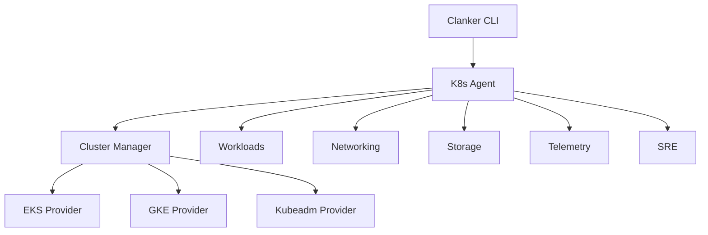

Clanker provides comprehensive Kubernetes cluster management capabilities, supporting multiple cluster types and platforms.

## Supported cluster types

Clanker can create, manage, and operate Kubernetes clusters on:

<CardGroup cols={3}>
  <Card title="Amazon EKS" icon="aws">
    Managed Kubernetes on AWS with eksctl or AWS CLI
  </Card>
  <Card title="Google GKE" icon="google">
    Managed Kubernetes on Google Cloud Platform
  </Card>
  <Card title="kubeadm" icon="server">
    Self-managed clusters on EC2 instances
  </Card>
</CardGroup>

## Core capabilities

### Cluster lifecycle management

Create, scale, and delete Kubernetes clusters with a unified CLI interface:

```bash
# Create an EKS cluster
clanker k8s create eks my-cluster --nodes 2 --node-type t3.small

# Create a GKE cluster
clanker k8s create gke my-cluster --gcp-project my-project --nodes 2

# Create a kubeadm cluster on EC2
clanker k8s create kubeadm my-cluster --workers 2 --key-pair my-key
```

### Application deployment

Deploy containerized applications with automatic service creation:

```bash
# Deploy nginx with LoadBalancer service
clanker k8s deploy nginx --name my-app --port 80 --replicas 3

# Preview deployment plan
clanker k8s deploy myapp:v1.0 --plan
```

### Monitoring and metrics

Access real-time resource usage metrics:

```bash
# View node metrics
clanker k8s stats nodes

# View pod metrics across all namespaces
clanker k8s stats pods -A

# View cluster-wide metrics
clanker k8s stats cluster
```

### AI-powered cluster insights

Use natural language to query your cluster:

```bash
# Ask questions about your cluster
clanker k8s ask "how many pods are running"
clanker k8s ask "which pods are using the most memory"
clanker k8s ask "why is my nginx pod failing"
```

## Quick start

<Steps>
  <Step title="Create a cluster">
    Choose your platform and create a cluster:
    
    ```bash
    clanker k8s create eks demo-cluster --nodes 2
    ```
  </Step>
  
  <Step title="Verify cluster status">
    Check that nodes are ready:
    
    ```bash
    clanker k8s list eks
    ```
  </Step>
  
  <Step title="Deploy an application">
    Deploy your first workload:
    
    ```bash
    clanker k8s deploy nginx --port 80
    ```
  </Step>
  
  <Step title="Monitor resources">
    View resource usage:
    
    ```bash
    clanker k8s stats pods
    ```
  </Step>
</Steps>

## Configuration

Clanker reads AWS and GCP credentials from your environment:

<CodeGroup>
```bash AWS Configuration
# Configure AWS credentials
aws configure --profile myprofile

# Set default region in clanker config
clanker config set infra.aws.default_region us-west-2
```

```bash GCP Configuration
# Authenticate with GCP
gcloud auth login

# Set default project
gcloud config set project my-project-id
```
</CodeGroup>

## Architecture

Clanker's Kubernetes management is built with a modular architecture:



Each provider implements the same interface, enabling consistent operations across platforms.

## Next steps

<CardGroup cols={2}>
  <Card title="Cluster management" icon="layer-group" href="/kubernetes/cluster-management">
    Learn how to create and manage clusters
  </Card>
  <Card title="Deployments" icon="rocket" href="/kubernetes/deployments">
    Deploy and manage applications
  </Card>
  <Card title="Ask mode" icon="comments" href="/kubernetes/ask-mode">
    Use AI to query your cluster
  </Card>
  <Card title="Monitoring" icon="chart-line" href="/kubernetes/monitoring">
    Monitor cluster health and metrics
  </Card>
</CardGroup>